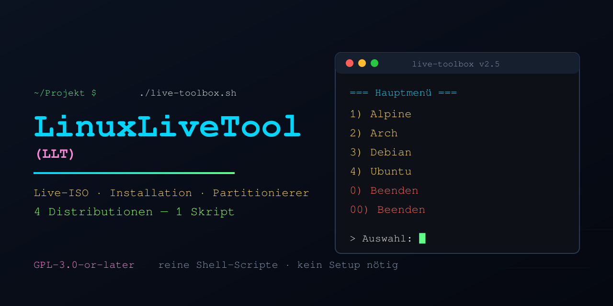

# LinuxLiveTool (LLT)



**Deutsch** | [English](#english)

---

## Deutsch

### Was ist LinuxLiveTool?

`live-toolbox.sh` ist **ein einziges, in sich geschlossenes shell-Skript**, das die vier
LinuxLiveTools für **Ubuntu, Debian, Arch und Alpine** enthält. Jedes Tool kann:

- eine **Live-ISO vom laufenden System** erstellen (BIOS **und** UEFI bootfähig, remastert — das eigene System als bootbares Abbild),
- das **Live-System auf Festplatte/Partition installieren** (inkl. Bootloader),
- **Festplatten/Partitionen partitionieren und formatieren** (interaktiver Partitionierer),
- Bau-Artefakte **aufräumen** und mögliche **Installationsziele anzeigen**.

Das Skript muss nicht installiert werden: herunterladen, ausführbar machen, starten.
Alle vier Tools stecken als Datenblock im Skript selbst und werden bei Bedarf
entpackt und ausgeführt.

### Schnellstart

```shell
chmod +x live-toolbox.sh
./live-toolbox.sh              # interaktives Menü
```

### Das Hauptmenü

```
  1) Alpine
  2) Arch
  3) Debian
  4) Ubuntu
  0)  Beenden
  00) Beenden
```

Jede Distribution enthält genau ein Tool; die Auswahl startet es **direkt**.
Im Tool-Menü gilt überall:

- **0** = genau ein Menü zurück
- **00** = das **gesamte Skript sofort beenden** (aus jedem Untermenü heraus)

### Funktionsumfang der vier Tools

| Funktion | ubuntulive-tool | debianlive-tool | archlive-tool | alpinelive-tool |
|---|---|---|---|---|
| Live-ISO vom laufenden System (BIOS + UEFI) | ✓ | ✓ | ✓ | ✓ (mkalpe-live) |
| Live-System auf Festplatte/Partition installieren | ✓ | ✓ | ✓ | ✓ (alpe-install, offline) |
| Partitionierer (GPT/MBR, anlegen/löschen/formatieren, Flags ESP/BIOS-Boot) | ✓ | ✓ | ✓ | ✓ (alpe-part) |
| Aufräumen der ISO-Bau-Artefakte | ✓ | ✓ | ✓ | ✓ |
| Mögliche Installationsziele anzeigen | ✓ | ✓ | ✓ | ✓ |
| Einzelskripte exportieren (Partitionierer/ISO/Installation) | ✓ | ✓ | ✓ | ✓ |
| SquashFS-Kompression wählbar (xz/zstd/lzma/gzip/lzo/lz4) | ✓ | ✓ | ✓ | ✓ |

Besonderheiten:

- **alpinelive-tool** erzeugt die ISO aus dem installierten System (apkovl + modloop)
  und enthält einen **offline-fähigen Installer** — die gebootete ISO kann ohne Netz
  installieren. Der Partitionierer **startet immer mit Root-Rechten**.
- **ubuntu/debian/archlive-tool** fragen Root-Rechte an, sobald eine Aktion sie
  benötigt, und führen **direkt die gewählte Aktion** als root aus — keine erneute
  Menüauswahl nach dem Root-Wechsel.
- **Eigene Tools einpflegen:** mit `-x` entpacken, ändern, mit `-r` wieder
  einbetten — Details im Abschnitt [Tools aktualisieren](#tools-aktualisieren--der--r-workflow).

### Befehlszeile (CLI)

```shell
./live-toolbox.sh                       # interaktives Menü (Standard: Deutsch)

./live-toolbox.sh -x  <verzeichnis>     # alle 4 Tools flach entpacken
./live-toolbox.sh -xx <verzeichnis>     # die 12 Einzelskripte aller 4 Distributionen entpacken
./live-toolbox.sh -xx arch <verzeichnis># nur die 3 Einzelskripte einer Distribution
                                        #   (arch | alpine | ubuntu | debian | all)
./live-toolbox.sh -r  <verzeichnis>     # veraenderte Tools aus -x/-xx wieder einbetten
                                        #   (VERSION wird um 0.1 erhöht, Backup .bak)
./live-toolbox.sh -v                    # Version + Versionen aller enthaltenen Tools
./live-toolbox.sh -de | -en             # Sprache erzwingen (Standard: DE)
./live-toolbox.sh -nc                   # ohne Farben (Fallback für ältere Konsolen;
                                        #   Farben sind bei nicht-Terminal automatisch aus)
./live-toolbox.sh -h                    # Hilfe
```

Was `-x`, `-xx` und `-r` im Detail machen: eigene Abschnitte direkt unterhalb.

Verzeichnisse werden bei Bedarf automatisch angelegt. Bei `-r` bleiben unveränderte
Tools unberührt; nur tatsächlich geänderte werden ersetzt.

Jedes Tool ist auch **einzeln lauffähig** und bietet dieselbe Extraktion:

```shell
./ubuntulive-tool  -x <verz>   # oder: export -s 1,2,3 -o <verz>
./debianlive-tool  -x <verz>
./archlive-tool    -x <verz>
./alpinelive-tool  -x <verz>   # schreibt mkalpe-live.sh, alpe-install.sh, alpe-part
```

### Tools extrahieren — `-x`

Holt die vier eingebetteten Tools aus dem Bündel heraus — **flach** in ein
Zielverzeichnis (wird bei Bedarf automatisch angelegt), **byte-identisch** und
ausführbar:

```shell
./live-toolbox.sh -x ~/tools
```

Ergebnis:

```text
~/tools/ubuntulive-tool
~/tools/debianlive-tool
~/tools/archlive-tool
~/tools/alpinelive-tool
```

Wofür: die Tools einzeln starten und ausprobieren, an andere weitergeben —
oder als Grundlage für eigene Anpassungen (→ zurück ins Bündel mit `-r`,
siehe unten).

### Einzelskripte exportieren — `-xx`

Jedes Tool enthält seine **drei Bausteine** (Installation / ISO / Partitionierer)
selbst. Mit `-xx` werden sie über die eingebaute Export-Funktion als
**eigenständige, separat lauffähige Skripte** geschrieben:

```shell
./live-toolbox.sh -xx ~/skripte        # alle 4 Distributionen (12 Dateien)
./live-toolbox.sh -xx arch ~/skripte   # nur arch
                                       #   (arch | alpine | ubuntu | debian | all)
```

Ergebnis für arch:

```text
~/skripte/archlive-tool-install.sh
~/skripte/archlive-tool-iso.sh
~/skripte/archlive-tool-part.sh
```

Wofür: an den einzelnen Bausteinen arbeiten, ohne das große Tool im Blick zu
haben. **Wichtig:** Diese Einzelskripte laufen unabhängig, werden aber **nicht**
über `-r` zurück ins Bündel gebracht — das gilt nur für die Tool-Dateien aus
`-x`.

### Tools aktualisieren — der `-r`-Workflow

Die vier Tools sind **eingebettet** — zum Ändern musst du `live-toolbox.sh` nie
direkt anfassen. Der sichere Weg:

```shell
./live-toolbox.sh -x  ~/tools     # 1. alle 4 Tools entpacken (flach)

#  2. Tool(s) in ~/tools bearbeiten und VORHER einzeln testen,
#     z. B.:  ./ubuntulive-tool part

./live-toolbox.sh -r  ~/tools     # 3. Änderungen wieder einbetten
```

**Was `-r` genau macht:**

- vergleicht jedes entpackte Tool mit der eingebetteten Version und bettet
  **nur tatsächlich geänderte** Tools wieder ein — alles Unveränderte bleibt an
  seiner Stelle
- legt **vorher automatisch eine Sicherung** an (`live-toolbox.sh.bak`) —
  du kannst also jederzeit einen Schritt zurück
- erhöht die **VERSION um 0.1** (mit Überlauf: 1.9 → 2.0), damit du am
  Versionsstand siehst, welchen Stand du gerade hast — `-v` zeigt die
  Versionen aller Tools live an
- meldet *„Keine veränderten Skripte - nichts zu tun"*, wenn du nichts
  geändert hast — dann passiert auch nichts

**Wichtig zu wissen:**

- `-r` erwartet die **Tool-Dateien** aus `-x` (also z. B. `ubuntulive-tool`
  selbst). Die mit `-xx` exportierten Einzelskripte (install/iso/part) sind
  eigenständige Dateien und werden **nicht** wieder eingebettet.
- Das Backup `.bak` wird bei **jedem** Re-Embed neu überschrieben — es gilt
  immer nur für den letzten Lauf. Willst du länger zurück, sichere die Datei
  zusätzlich von Hand.

### Sprache

Standard ist **Deutsch**. Mit `-de` oder `-en` lässt sich die Sprache erzwingen;
ganz am Anfang jedes Skripts kann die Sprache auch fest eingestellt werden
(`SPRACHE=DE` bzw. `SPRACHE=EN`). Ist eine Sprache gewählt, erscheinen **ausschließlich**
Ausgaben dieser Sprache — keine Mischsprachen.

### Kein Autologin — bewusste Entscheidung

Eine **automatische Anmeldung (Autologin)** wurde **absichtlich nicht
implementiert** — aus Sicherheitsbedenken: Ein Live-System, das sich ohne
Passwortabfrage automatisch als Root/Benutzer anmeldet, bietet jedem, der
physischen Zugriff auf den Rechner erhält, sofort vollen Zugriff (inkl.
Festplattenzugriff, Netzwerkkonfiguration, Installer). Stattdessen gilt:

- Das Live-System fragt nach Anmeldedaten bzw. erwartet eine bewusste Anmeldung.
- Die Tools fordern Root-Rechte nur dann an, wenn eine Aktion sie wirklich
  benötigt (per `sudo` bzw. `su`, mit Passwortabfrage).

Wer Autologin dennoch möchte, muss es nach dem Booten selbst und bewusst
einrichten — das Skript liefert es nicht mit.

### Voraussetzungen

- Linux, `shell` bzw. POSIX-`sh` (busybox-ash reicht für das Alpine-Tool)
- Root-Rechte für schreibende Aktionen (werden per `sudo` — Fallback `su` — angefordert)
- Für den ISO-Bau: die jeweiligen Pakete (z. B. `xorriso`, `squashfs-tools`,
  `syslinux`, `grub-bios`, `grub-efi`, `mtools`); das Alpine-Tool erkennt fehlende
  Pakete und bietet die Installation per `apk` an

### Aufbau

Die vier Tools liegen zwischen Marker-Zeilen im Skript
(`#@@@SCRIPT:<distro>/<datei>@@@` … `#@@@END:…@@@`), nach `exit 0` als reiner
Datenblock — sie werden nie von der Shell des Wrappers geparst. Mit `-x`/`-xx`
lassen sie sich exakt 1:1 wiederherstellen.

### Lizenz

**GPL-3.0-or-later** — veröffentlicht unter der GNU General Public License
Version 3 (oder später); siehe die Datei [`LICENSE`](LICENSE). Der vollständige
Lizenz-Hinweis steht im Kopf des Skripts.

### Hinweis

Nutzung auf eigene Verantwortung — das Partitionierer- und
Installations-Tool schreiben auf Festplatten!

---

<a name="english"></a>
## English

### What is LinuxLiveTool?

`live-toolbox.sh` is **a single, self-contained shell script** containing the four
LinuxLiveTools for **Ubuntu, Debian, Arch and Alpine**. Each tool can:

- create a **live ISO from the running system** (bootable on BIOS **and** UEFI,
  remastered — your own system as a bootable image),
- **install the live system to a disk or partition** (including bootloader),
- **partition and format disks/partitions** (interactive partitioner),
- **clean up** build artifacts and **show possible installation targets**.

No installation required: download, make executable, run. All four tools are
embedded inside the script itself as a data block and are extracted and executed
on demand.

### Quick start

```shell
chmod +x live-toolbox.sh
./live-toolbox.sh              # interactive menu
```

### The main menu

```
  1) Alpine
  2) Arch
  3) Debian
  4) Ubuntu
  0)  Quit
  00) Quit
```

Each distribution contains exactly one tool; selecting it starts that tool
**directly**. Inside the tool menus, everywhere:

- **0** = go back exactly one menu
- **00** = **immediately terminate the whole script** (from any submenu)

### Feature set of the four tools

| Feature | ubuntulive-tool | debianlive-tool | archlive-tool | alpinelive-tool |
|---|---|---|---|---|
| Live ISO from the running system (BIOS + UEFI) | ✓ | ✓ | ✓ | ✓ (mkalpe-live) |
| Install the live system to disk/partition | ✓ | ✓ | ✓ | ✓ (alpe-install, offline) |
| Partitioner (GPT/MBR, create/delete/format, ESP/BIOS-boot flags) | ✓ | ✓ | ✓ | ✓ (alpe-part) |
| Clean up ISO build artifacts | ✓ | ✓ | ✓ | ✓ |
| Show possible installation targets | ✓ | ✓ | ✓ | ✓ |
| Export standalone scripts (partitioner/ISO/installation) | ✓ | ✓ | ✓ | ✓ |
| Selectable SquashFS compression (xz/zstd/lzma/gzip/lzo/lz4) | ✓ | ✓ | ✓ | ✓ |

Details:

- **alpinelive-tool** builds the ISO from the installed system (apkovl + modloop)
  and includes an **offline installer** — the booted ISO can install without a
  network. The partitioner **always starts with root privileges**.
- **ubuntu/debian/archlive-tool** request root privileges as soon as an action
  needs them and then **execute the selected action directly as root** — no
  repeated menu selection after the root switch.
- **Update your own tools:** extract with `-x`, modify, re-embed with `-r` —
  details in [Updating tools](#updating-tools--the--r-workflow).

### Command line (CLI)

```shell
./live-toolbox.sh                       # interactive menu (default: German)

./live-toolbox.sh -x  <directory>       # extract all 4 tools, flat
./live-toolbox.sh -xx <directory>       # extract the 12 standalone scripts of all 4 distros
./live-toolbox.sh -xx arch <directory>  # only the 3 standalone scripts of one distro
                                        #   (arch | alpine | ubuntu | debian | all)
./live-toolbox.sh -r  <directory>       # re-embed modified tools from -x/-xx
                                        #   (VERSION is bumped by 0.1, backup .bak)
./live-toolbox.sh -v                    # version + versions of all embedded tools
./live-toolbox.sh -de | -en             # force language (default: German)
./live-toolbox.sh -nc                   # no colors (fallback for older terminals;
                                        #   colors are also off when not a terminal)
./live-toolbox.sh -h                    # help
```

What `-x`, `-xx` and `-r` do in detail: dedicated sections right below.

Directories are created automatically if missing. With `-r`, unchanged tools are
left untouched; only actually changed ones are replaced.

Every tool also runs **standalone** and offers the same extraction:

```shell
./ubuntulive-tool  -x <dir>   # or: export -s 1,2,3 -o <dir>
./debianlive-tool  -x <dir>
./archlive-tool    -x <dir>
./alpinelive-tool  -x <dir>   # writes mkalpe-live.sh, alpe-install.sh, alpe-part
```

### Extracting tools — `-x`

Pulls the four embedded tools out of the bundle — **flat** into a target
directory (created automatically if missing), **byte-identical** and
executable:

```shell
./live-toolbox.sh -x ~/tools
```

Result:

```text
~/tools/ubuntulive-tool
~/tools/debianlive-tool
~/tools/archlive-tool
~/tools/alpinelive-tool
```

Use cases: run and try the tools standalone, share them — or use them as a
starting point for your own modifications (→ back into the bundle with `-r`,
see below).

### Exporting standalone scripts — `-xx`

Each tool contains its **three building blocks** (installation / ISO /
partitioner) internally. With `-xx` they are written out via the built-in
export function as **independent, separately runnable scripts**:

```shell
./live-toolbox.sh -xx ~/scripts        # all 4 distros (12 files)
./live-toolbox.sh -xx arch ~/scripts   # arch only
                                       #   (arch | alpine | ubuntu | debian | all)
```

Result for arch:

```text
~/scripts/archlive-tool-install.sh
~/scripts/archlive-tool-iso.sh
~/scripts/archlive-tool-part.sh
```

Use case: work on individual building blocks without the big tool in the way.
**Important:** These standalone scripts run on their own but are **not** put
back into the bundle via `-r` — that only applies to the tool files from `-x`.

### Updating tools — the `-r` workflow

The four tools are **embedded** — you never have to touch `live-toolbox.sh`
directly to change them. The safe path:

```shell
./live-toolbox.sh -x  ~/tools     # 1. extract all 4 tools (flat)

#  2. edit the tool(s) in ~/tools and test them standalone FIRST,
#     e.g.:  ./ubuntulive-tool part

./live-toolbox.sh -r  ~/tools     # 3. re-embed your changes
```

**What `-r` does exactly:**

- compares each extracted tool against the embedded version and re-embeds
  **only the tools that actually changed** — everything untouched stays as is
- **creates a backup automatically first** (`live-toolbox.sh.bak`) — you can
  always go back one step
- bumps the **VERSION by 0.1** (with rollover: 1.9 → 2.0) so the version
  tells you which state you are on — `-v` shows all tool versions live
- reports *"No changed scripts found - nothing to do"* when you changed
  nothing — and then does nothing

**Good to know:**

- `-r` expects the **tool files** from `-x` (e.g. `ubuntulive-tool` itself).
  The standalone scripts exported with `-xx` (install/iso/part) are separate
  files and are **not** re-embedded.
- The `.bak` backup is **overwritten on every** re-embed — it only covers the
  last run. To go back further, keep an extra copy by hand.

### Language

The default language is **German**. Use `-de` or `-en` to force a language; you
can also set it permanently at the top of each script (`SPRACHE=DE` or
`SPRACHE=EN`). Once a language is chosen, output appears in **that language
only** — no mixed languages.

### No autologin — deliberate decision

**Automatic login (autologin)** was **deliberately not implemented** for
security reasons: a live system that logs in automatically as root/user without
any password prompt gives anyone with physical access to the machine immediate
full access (including disks, network configuration and the installer).
Instead:

- The live system asks for credentials or expects a conscious login.
- The tools request root privileges only when an action actually needs them
  (via `sudo` or `su`, with a password prompt).

If you want autologin anyway, you must set it up yourself after booting —
the script does not ship it.

### Requirements

- Linux, `shell` or POSIX-`sh` (busybox-ash is sufficient for the Alpine tool)
- Root privileges for write actions (requested via `sudo` — fallback `su`)
- For building ISOs: the respective packages (e.g. `xorriso`, `squashfs-tools`,
  `syslinux`, `grub-bios`, `grub-efi`, `mtools`); the Alpine tool detects missing
  packages and offers installation via `apk`

### Structure

The four tools sit between marker lines inside the script
(`#@@@SCRIPT:<distro>/<file>@@@` … `#@@@END:…@@@`), after `exit 0` as a pure data
block — the wrapper shell never parses them. `-x`/`-xx` restore them exactly 1:1.

### License

**GPL-3.0-or-later** — released under the GNU General Public License version 3
(or later); see the [`LICENSE`](LICENSE) file. The full license notice is at
the top of the script.

### Note

Use at your own risk — the partitioner and installer tools write to disks!
